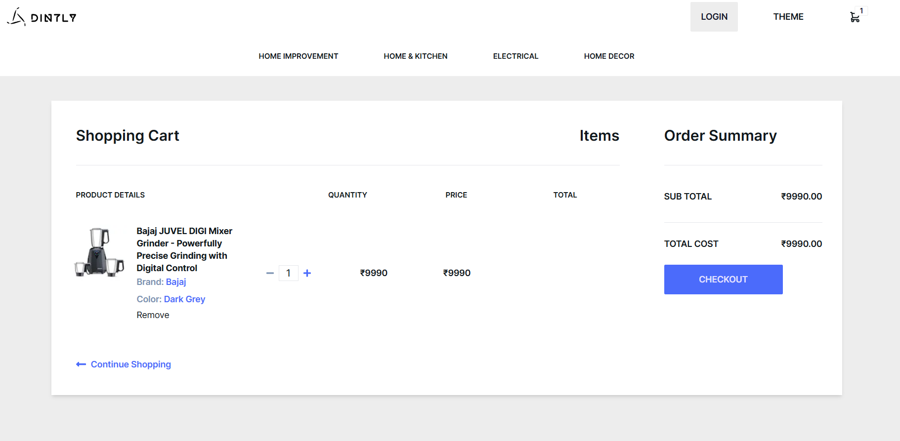

# Dintly E-commerce Platform

This is a closed-source e-commerce platform designed to provide a seamless online shopping experience. Built with Next.js for the frontend and NestJS for the backend, it incorporates various modern web development practices and technologies to ensure high performance, security, and usability.

## Features

**Frontend**

- **Home Page:** A dynamic homepage showcasing featured products.
- **Product Sections:** Sections for newly arrived products, seasonal products, and category-wise products.
- **Product Pages**: Detailed pages for individual products with descriptions, reviews, and related products.
- **Cart Page:** Allows users to view and manage items in their cart.
- **Checkout Page:** Secure and efficient checkout process with multiple payment options.
- **Search and Filtering**: Advanced search functionality with filters to help users find products easily.
- **User Pages:**
`View Orders`
`Wishlist`
`Profile Settings`
`Reward Page`
- **SEO Strategies:** Implemented to ensure high search engine rankings and fast page load times.
- **Authentication:** User authentication handled by Appwrite.
- **Payment Gateways:** Integrated with Razorpay and PhonePe for secure payments.

**Backend**
- **NestJS:** Robust backend framework used for API development.
- **MongoDB:** Database used for storing product, user, and order information.
- **APIs:**
`Product API`
`User API`
`Order API`
- **ACID Compliance:** Ensuring consistency and reliability of data during CRUD operations.
- **Redis:** Used for caching and queuing to enhance performance.
- **Email Service:** Automated email notifications for various user actions.
- **Cron Jobs:** Scheduled tasks for maintenance and updates.
- **Authorization**: Secure access control for various parts of the application.
- **Fastify:** High-performance web server framework used to boost backend performance.
- **Security Features:** Implemented various security measures to protect user data and transactions.

## Technologies Used

**Frontend**

- Next.js
- Zustand: State management
- Appwrite: Authentication
- Razorpay and PhonePe: Payment gateways
- Typesense - Searching and Filtering

**Backend**

- NestJS
- MongoDB
- Redis: Cache and queue management
- Fastify
- Other Tools: Email service, cron jobs, security features

## Picture Gallery

Below are some screenshots showcasing the e-commerce platform:

## Website
You can view the live website here [https://dintly.in](https://dintly.in)

**Please note:** The website is hosted on a free server instance, which may cause delays in loading. If the website takes a long time to load or shows an error, please wait for at least 1 minute and try again. The free server instance spins down with inactivity, which can delay requests by 50 seconds or more. Thank you for your patience!